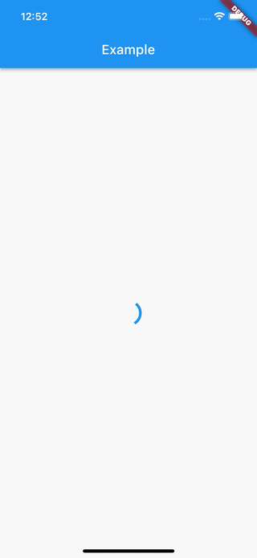

# simple_async_builder
Simple `Future` and `Stream` builder for Flutter.
This package provides `AsyncFutureBuilder` and `AsyncStreamBuilder` - more developer-friendly 
versions of `FutureBuilder` and `StreamBuilder`.

This package was inspired by `async_builder`.

## Usage

This simple code:
```dart
AsyncFutureBuilder<int>(
  future: futureClickCount,
  builder: (context, value) => Text("Button was clicked $value times"),
)
```
let's you achieve this:


You can find a complete example in `example/lib/main.dart`