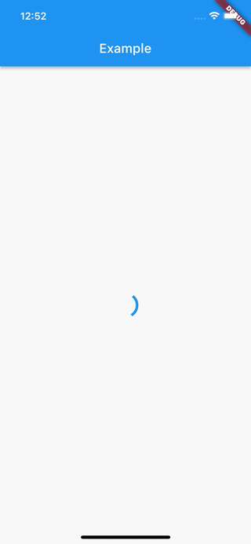

# simple_async_builder

[](https://pub.dartlang.org/packages/simple_async_builder)
[](https://github.com/bartektartanus/simple_async_builder/actions/workflows/flutter.yml)

Simple `Future` and `Stream` builder for Flutter.
This package provides `AsyncFutureBuilder` and `AsyncStreamBuilder` - more developer-friendly 
versions of `FutureBuilder` and `StreamBuilder`.

This package was inspired by `async_builder`.

## Usage

This simple code:
```dart
AsyncFutureBuilder<int>(
  future: Future<int>.delayed(const Duration(seconds: 2), () => 3),
  builder: (context, value) => Text("Button was clicked $value times"),
)
```
let's you achieve this:



Same result can be achieved using Flutter `FutureBuilder`:
```dart
FutureBuilder<int>(
  future: Future<int>.delayed(const Duration(seconds: 2), () => 3),
  builder: (context, snapshot) {
    switch(snapshot.connectionState) {
      case ConnectionState.none:
        return Text("Error");
      case ConnectionState.waiting:
        return CircularProgressIndicator();
      case ConnectionState.active:
      case ConnectionState.done:
        return Center(child: Text('Button was clicked ${snapshot.data ?? 0} times'));
    }
  }
);
```

You can find a complete example in `example/lib/main.dart`

### Error reporter

All elements of `AsyncFutureBuilder` can be customized:

```dart
class AdvancedWidget extends StatelessWidget {
  const AdvancedWidget({Key? key}) : super(key: key);

  @override
  Widget build(BuildContext context) {
    final futureClickCount = Future<int>.delayed(const Duration(seconds: 2), () => 3);
    return Scaffold(
      appBar: AppBar(title: const Text('Example')),
      body: AsyncFutureBuilder<int>(
        future: futureClickCount,
        waiting: (context) => Row(children: [CircularProgressIndicator(), Text("Loading...")],),
        builder: (context, value) => Center(child: Text('Button was clicked $value times')),
        error: (context, error, stack) => Text("Ups, something went wrong... $error"),
        reportError: (errorDetail) => reportToFirebase(errorDetail.exception.toString()),
      ),
    );
  }

  void reportToFirebase(Object error) {
    debugPrint(error.toString());
  }
}
```
